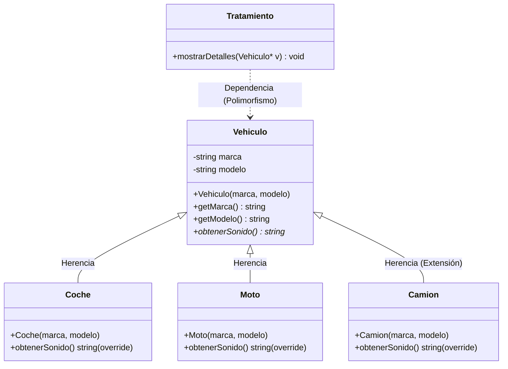

# MEMORIA EXPLICATIVA: AMPLIACIÓN DE JERARQUÍAS DE OBJETOS EN C++

## 1. Introducción y Objetivos
El objetivo principal de esta actividad es diseñar e implementar una jerarquía de clases orientada a objetos en C++ que cumpla con el **Principio de Abierto/Cerrado (Open/Closed Principle)**: la jerarquía debe estar *abierta a la extensión, pero cerrada a la modificación*. Mediante el uso de una **biblioteca estática** y un **proyecto de consola**, se demuestra cómo el código existente de procesamiento (la clase `Tratamiento`) puede operar con nuevos tipos de objetos creados *a posteriori* en el proyecto cliente sin necesidad de modificar ni recompilar la biblioteca original.

---

## 2. Diseño del Sistema y Jerarquía de Clases
Se ha modelado un sistema del mundo real basado en **Vehículos y su acústica**. El diseño se organiza dentro del espacio de nombres `poo` para evitar colisiones de nombres y estructurar el código adecuadamente.

### Jerarquía de Clases:
1.  **`Vehiculo` (Clase Base):** Define las propiedades comunes de cualquier vehículo (`marca` y `modelo` como miembros privados) y expone una interfaz común mediante un método virtual:
    *   `virtual std::string obtenerSonido() const;`
2.  **`Coche` (Clase Derivada - en Biblioteca):** Hereda de `Vehiculo` y redefine el sonido específico para un coche.
3.  **`Moto` (Clase Derivada - en Biblioteca):** Hereda de `Vehiculo` y redefine el sonido específico para una motocicleta.
4.  **`Camion` (Clase Derivada - Extensión en Consola):** Hereda de `Vehiculo` y redefine el sonido específico para un camión. Esta clase no forma parte de la biblioteca original, sino que se define en el proyecto de consola que la consume.
5.  **`Tratamiento` (Clase de Utilidad - en Biblioteca):** Contiene un método que recibe un puntero a la clase base (`Vehiculo*`) y muestra sus detalles en la salida estándar utilizando el enlace dinámico.

---

## 3. Estructura de Archivos por Proyecto
El código se organiza siguiendo la directriz de separar la interfaz (`.h`) de la implementación (`.cpp`) para cada clase.

### Proyecto 1: `BibliotecaVehiculos` (Biblioteca Estática)
*   **`Vehiculo.h` / `Vehiculo.cpp`**: Declaración e implementación de la clase base.
*   **`Coche.h` / `Coche.cpp`**: Declaración e implementación de la clase `Coche`.
*   **`Moto.h` / `Moto.cpp`**: Declaración e implementación de la clase `Moto`.
*   **`Tratamiento.h` / `Tratamiento.cpp`**: Procesamiento genérico de punteros a `Vehiculo`.

### Proyecto 2: `AppConsola` (Aplicación de Consola)
*   **`Camion.h` / `Camion.cpp`**: Clase derivada agregada localmente para ampliar la jerarquía sin modificar la biblioteca.
*   **`main.cpp`**: Punto de entrada de la aplicación que interactúa con la biblioteca y la extensión local.

---

## 4. Conceptos Teóricos de POO Aplicados
El diseño implementa varios de los pilares fundamentales de la Programación Orientada a Objetos:

*   **Encapsulamiento y Ocultación de Datos:** Los atributos `marca` y `modelo` en `Vehiculo` son estrictamente `private`. El acceso a los mismos desde el exterior (como en la clase `Tratamiento`) se realiza exclusivamente a través de los métodos públicos *getters* (`getMarca()`, `getModelo()`), garantizando el control sobre el estado del objeto.
*   **Herencia:** Las clases `Coche`, `Moto` y `Camion` heredan la estructura y el comportamiento de `Vehiculo` (relación "es un"), permitiendo la reutilización de código y el establecimiento de un tipo común.
*   **Polimorfismo y Enlace Dinámico:** El método `obtenerSonido()` se declara como `virtual` en la clase base. Al llamar a este método a través de un puntero a la clase base (`Vehiculo*`) en `Tratamiento::mostrarDetalles()`, C++ utiliza la **tabla de funciones virtuales (vtable)** en tiempo de ejecución para invocar el método de la clase derivada real (enlace dinámico).
*   **Acoplamiento Débil:** La clase `Tratamiento` solo depende de la interfaz de `Vehiculo`. No tiene conocimiento alguno de la existencia de `Coche`, `Moto` o `Camion`, lo que reduce drásticamente el acoplamiento y facilita la extensibilidad.

---

## 5. Verificación de la Extensibilidad y No Recompilación
Para demostrar empíricamente que la biblioteca no necesita ser recompilada al añadir `Camion`, se realizaron los siguientes pasos:
1.  Se compiló inicialmente la solución completa, generando el archivo físico `BibliotecaVehiculos.lib` en la carpeta de salida.
2.  Se añadió la clase `Camion` (`.h` y `.cpp`) única y exclusivamente dentro del proyecto `AppConsola`.
3.  En `main.cpp`, se instanció un objeto de tipo `Camion` mediante un puntero `Vehiculo*` y se le pasó al método `mostrarDetalles` de `Tratamiento` (definido dentro de la biblioteca).
4.  Se realizó una modificación menor en la cadena devuelta por `Camion::obtenerSonido()` y se pulsó **Compilar** únicamente en el proyecto de consola (`AppConsola`).
5.  El enlazador vinculó correctamente el nuevo objeto en tiempo de ejecución. La biblioteca `BibliotecaVehiculos.lib` no fue reconstruida ni modificada, demostrando que su código binario es totalmente independiente de futuras extensiones de la jerarquía.
